# Overwatch 2 Lore Hub

## Purpose

This Project is a static website that focuses on the description of the complex lore for the video game release by Blizzard Activision Overwatch 2. It aims to de clutter all of teh information out there that surrounds the story of this video game and put it all in one place for people to see. It provides users with a detailed timeline on all of the events that take place during the story of the aforementioned video game while it's presented in a nice and clean manner making it more digestible for users to understand. 

This is the core purpose of this project, I feel that there was a problem when it came to learning the story behind this video game that you can't find out without scouring all corners of the internet so naturally I believe that this could be solved by bringing all of the information together into one place that that is clear concise and easily understandable.

This website was built using HTML and CSS as a Milestone Project#1 for the Code Institute's Full-Stack Software Development Course.

# UX Design

## User Stories

**As A First Time User**

* I want to understand the main purpose of the site
* I want to be able to learn more about the topic 
* I want to signup and join the community

**As A Returning User**

* I want to be a member of the community
* I want to be able to find detailed and up-to-date information about the topic
* I want to be able to interact with the information on the website

## Structure

**Home Page**

* Introduces the user to the topic 
* Grab and keep the users attention via the use of graphics and good use of the accent colour

**Timeline Page**

* Give the user and in depth look into the topic 
* Provide enough information where the user is satisfied 
* Present the information in a clear manner so that it can be easily digested

**Signup Page**

* Allow the user to be able to signup and join the club
* Provide a very simple and clear signup option so that sign ups would become more frequent
* The user is shown a success screen once the sign up is complete

## Design

**Wireframes**

Homepage Medium - Large Screens

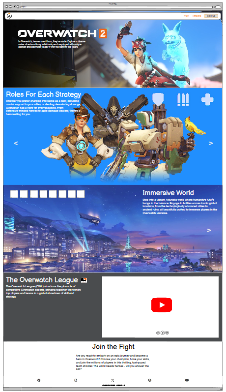

HomePage Small Screens

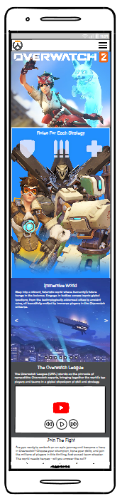

Timeline Page Medium - Large Screens

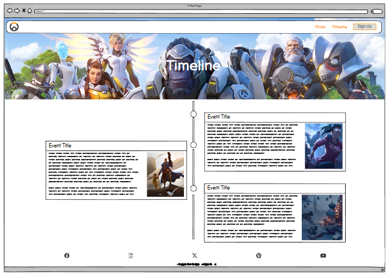

Timeline Small Screens

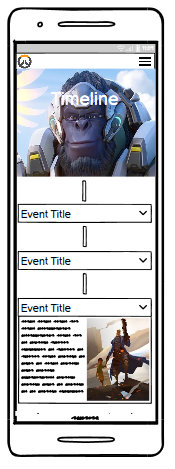

Signup Page Medium - Large Screens

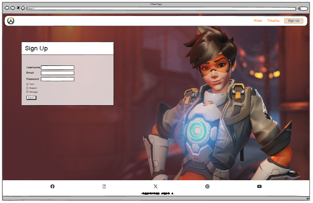

Signup Page Small Screens

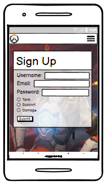

**Typography**

* Oswald was chosen as it's a bold attention grabbing font that looks and feels modern and professional. I also like how condensed the letter look as for the logo I wanted it to look nice and compact. In addition, Oswald also maintains excellent readability even at larger sizes making it a versatile choice for creating a bold a visual identity.

* Lato was chosen for use in paragraphs or long strings of text as it is a highly legible font making it an excellent choice for the main text of a website.

**Images**

* The Images in this project come from various sources as there is an abundance trailers and promotional content created by the video game company and even more edited by fans of the game which still have a very high quality. 

# Features

**Navigaton Bar**

* The Navigation bar is shown on every page with a logo on the left side when clicked the user is always taken back to the HomePage. This practise is used on the vast majority of webpages so that the user is already accustomed to this practise; this helps with familiarity on the website.

* The Navigation bar to the other webpages are displayed on the right of the screen each with a link to the pages that share the same name. These would be Home, Timeline and Signup.

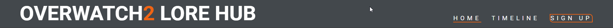

**Homepage Hero Image**

* This is the main image on the homepage which includes text of the sites name and a sub heading so that users already knwo what to expect.

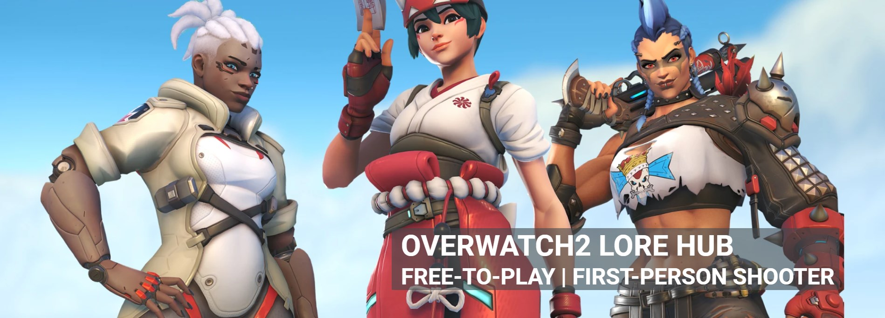

**Introduction Section**

* The Introduction section is shown right after the hero image on the homepage so that users can delve deeper into what to expect from the site and find out more.

* It encourages the user to keep exploring the site once they find out if they are intersted or not

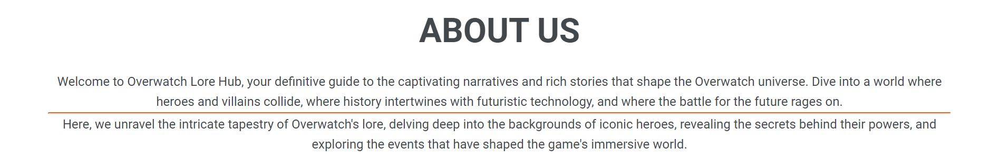

**Description Section**

* This section is used to show the user all of the different topics that are covered on the website by giving different snippets on each on respectiely. This will help gather intrigue and encourage the user to go out and look for the information that they want to find on the site.

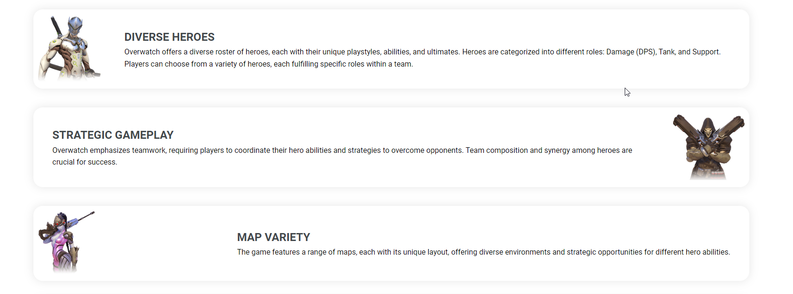

**'Meet The Heroes' Image Carousel**

* This is a graphic that allows the user to cycle through all of the different characters to expect to find out more about on the website. I think this would also keep up user retention rate as it allows the user to iteract with the site directly alongside seeing some of their favourite heroes.

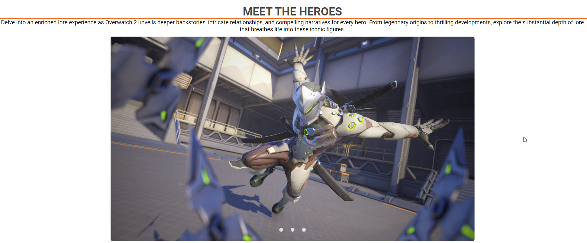

**Map Youtube Trailer**

* This is an embeded video which shows a trailer of one of the most historic maps within the video game. This allows users to interact with the site more while also getting a glimpse of what some more of the topics are going to be discussed.

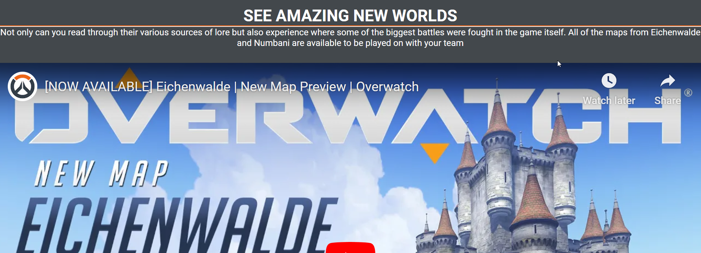

**Footer**

* The footer, just like the navigation bar, is shown on all pages on the website; The consistency of the design allows for a better user expeience as they gain a familiarity towards the website. It includes 5 links to social media platforms; Facebook, Twitter, Instagram, Youtube and Steam. 

* These links will open in new tabs so that the user doesn't have to leave the website to view the content.

* The footer also includes a small navigation bar for so that when users scroll down they are drawn to that section and encouraged to continue exploreing the site.

**Timeline Page**

* The timeline page includes a complete list of a series of events that allow the user to see everything that has happened in the story up until the present day. This is the main attraction of the site as the purpose was to be able to layout all of the story in a clear , understandable, and attractive manner.

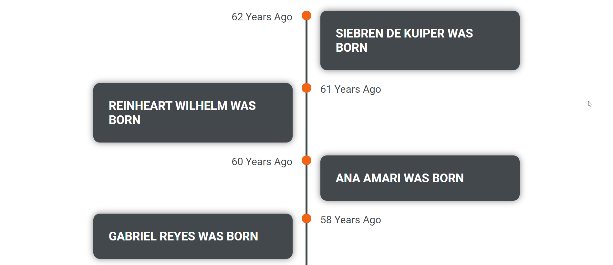

**Signup Page**

* This page includes a sign up form where the users can input their first name, last name, email and role that they like to play in the game.

* The purpose of this section is to beable to reengage user after they have left the site so that they can return and continue using the service.

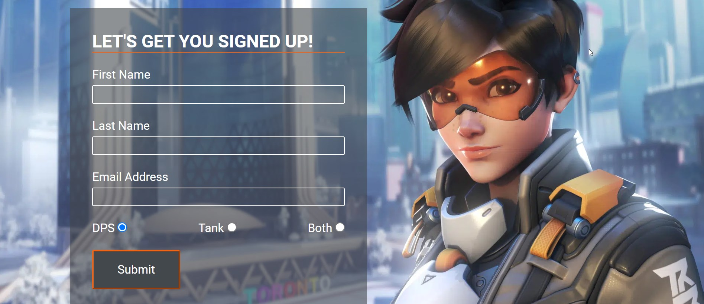

**Features Left To Implement**

*Signup success message/page: When the user successfully signs up they should be displayed with a message the they are congradulated and are able to see that nothing went wrong and they have been abel to sign up to the website.

# Testing

**Manual Testing**

Manual testing is performed to ensure website performs well on different browsers and devices.

**Browsers Used**
* Chrome
* Safari
* Microsoft Edge
* FireFox

**Devices Used**
* Mac Book
* Windows 10 desktop
* Samsung Galaxy Ultra 23
* Google Pixel 4a

The website is fully functional on all platforms.

**Functional Testing**

* Navigation Bar Links

All navigation bar links correctly send the user to the correct location.

Home -> index.HTML

Timeline -> timeline.HTML

Signup -> signup.HTML

**Validator Testing**

**HTML Checked**

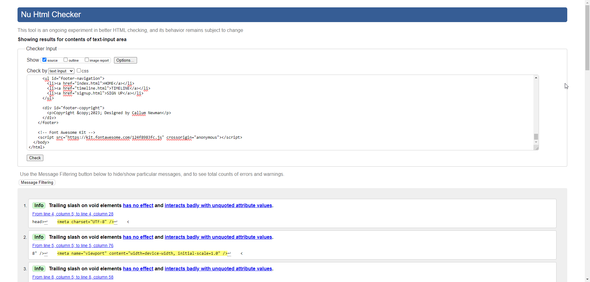

* The HTML was checked and validated by the official w3c Markup Validation Service

**CSS Checked**

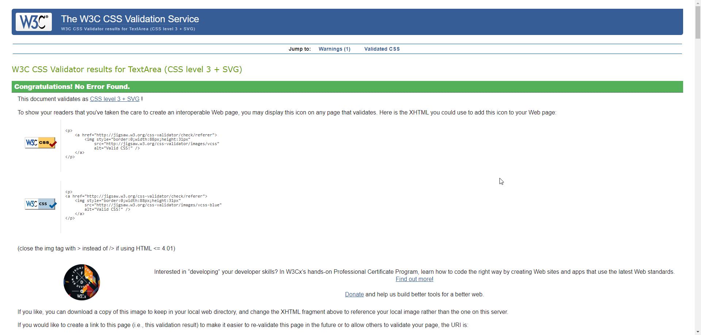

* The CSS was checked and validated by The W3C CSS Validation Service

# Deployment
The site was deployed to GitHub Pages.
1. Navigate to the Github repo being deployed
2. Select 'Settings'
3. Select 'Pages'
4. Scroll to the 'Build and deployment'/'Source' section
5. Find sub-section 'Branch'
6. From drop-down menu 'none'/'select branch' select source 'main' (or the preferred branch that you would like live)
7. Click 'Save'
8. Wait until you can see a link for the deployed page within Github Page section (this can take a while)

# Technologies
* HTML
* CSS
* GitHub
* Google Fonts
* Font Awesome
* Google Chrome Dev Tools
* Favicon.io
* Balsamiq
* W3C HTML Markup Validator
* W3C Jigsaw CSS Validator

# Credits
* Google Fonts
* FontAwesome
* W3Schools.com
* Google
* Youtube
* Love Running Project for general help